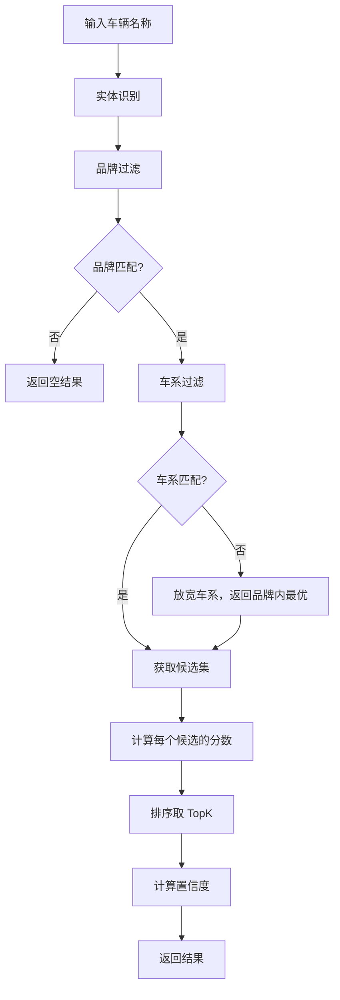

# 匹配引擎规格说明 (Matching Engine Spec)

## 1. 目标

基于规则和相似度计算，将输入车辆名称匹配到车型库中最相似的 `level_id`。

---

## 2. 输入/输出

### 输入
```python
query_text: str  # 车辆名称
top_k: int = 5   # 返回结果数量
```

### 输出
```python
@dataclass
class MatchResult:
    query: str                        # 原始查询
    extracted_entities: dict          # 提取的实体
    matches: List[MatchCandidate]     # 匹配结果
    debug: DebugInfo                  # 调试信息

@dataclass
class MatchCandidate:
    level_id: str
    score: float                      # 总分
    confidence: float                 # 置信度 0-1
    matched_entities: List[str]       # 匹配上的实体
    vehicle_info: dict                # 车型信息

@dataclass
class DebugInfo:
    candidates_after_brand: int
    candidates_after_series: int
    candidates_after_year: int
    final_candidates: int
    processing_time_ms: float
```

---

## 3. 打分规则

### 3.1 权重配置

| 实体 | 权重 | 匹配方式 | 说明 |
|------|------|----------|------|
| brand | 100 | 精确 | 必须匹配，否则过滤 |
| series | 80 | 精确 | 必须匹配，否则过滤 |
| year | 50 | 模糊 | 完全匹配+50，相差1年+30，相差2年+10 |
| displacement | 40 | 等价 | 1.4T=1.4TSI=1.4THP |
| range_km | 40 | 容差 | ±20km 视为匹配 |
| transmission | 30 | 精确 | 档位类型 |
| drive | 20 | 精确 | 驱动方式 |
| trim | 15 | 模糊 | 关键词匹配 |

### 3.2 排量等价规则

```python
DISPLACEMENT_EQUIVALENTS = {
    "1.4T": ["1.4TSI", "1.4THP"],
    "2.0T": ["2.0TSI", "2.0TFSI", "2.0THP"],
    "1.5L": ["1.5"],
    "2.0L": ["2.0"],
}
```

### 3.3 年款模糊匹配

```python
def score_year(query_year: int, candidate_year: int) -> float:
    diff = abs(query_year - candidate_year)
    if diff == 0:
        return 50.0
    elif diff == 1:
        return 30.0
    elif diff == 2:
        return 10.0
    else:
        return 0.0
```

---

## 4. 匹配流程



---

## 5. 接口定义

```python
class MatchingEngine:
    """匹配引擎"""
    
    def __init__(
        self,
        entity_extractor: EntityExtractor,
        vehicle_index: VehicleIndex,
        config_path: str = "config/matching_config.yaml"
    ):
        """
        初始化匹配引擎
        
        Args:
            entity_extractor: 实体识别器
            vehicle_index: 车型库索引
            config_path: 配置文件路径
        """
        pass
    
    def match(
        self, 
        query_text: str. 
        top_k: int = 5,
        min_score: float = 150.0
    ) -> MatchResult:
        """
        匹配车辆名称
        
        Args:
            query_text: 车辆名称
            top_k: 返回结果数量
            min_score: 最低分数阈值
            
        Returns:
            MatchResult: 匹配结果
        """
        pass
    
    def batch_match(
        self,
        queries: List[str],
        top_k: int = 5
    ) -> List[MatchResult]:
        """
        批量匹配
        
        Args:
            queries: 车辆名称列表
            top_k: 每条返回结果数量
            
        Returns:
            匹配结果列表
        """
        pass
    
    def _calculate_score(
        self,
        query_entities: ExtractedEntities,
        candidate: VehicleCandidate
    ) -> Tuple[float, List[str]]:
        """
        计算匹配分数
        
        Returns:
            (分数, 匹配的实体列表)
        """
        pass
    
    def _calculate_confidence(
        self,
        score: float,
        matched_entities: List[str]
    ) -> float:
        """
        计算置信度
        
        基于分数和匹配实体数量
        """
        pass
```

---

## 6. 配置文件

```yaml
# config/matching_config.yaml

# 权重配置
weights:
  brand: 100
  series: 80
  year: 50
  displacement: 40
  range_km: 40
  transmission: 30
  drive: 20
  trim: 15

# 阈值配置
thresholds:
  min_score: 150        # 最低返回分数
  high_confidence: 250  # 高置信度阈值
  
# 返回数量
top_k: 5

# 模糊匹配规则
fuzzy_rules:
  year_tolerance: 2     # 年款容差
  range_tolerance: 20   # 续航容差 (km)

# 排量等价映射
displacement_equivalents:
  "1.4T": ["1.4TSI", "1.4THP"]
  "2.0T": ["2.0TSI", "2.0TFSI", "2.0THP"]
  "1.5L": ["1.5"]
```

---

## 7. 示例

### 输入
```
"宝马/X1/2016款 2.0T 自动 20Li豪华型前驱"
```

### 输出
```json
{
  "query": "宝马/X1/2016款 2.0T 自动 20Li豪华型前驱",
  "extracted_entities": {
    "brand": "宝马",
    "series": "X1",
    "year": 2016,
    "displacement": "2.0T",
    "transmission": "自动",
    "drive": "前驱",
    "trim": "豪华型"
  },
  "matches": [
    {
      "level_id": "BMW0X10A0015",
      "score": 295,
      "confidence": 0.94,
      "matched_entities": ["brand", "series", "year", "displacement", "transmission", "drive", "trim"],
      "vehicle_info": {
        "brand": "宝马",
        "series": "X1",
        "sales_name": "2.0T 自动 20Li豪华版",
        "year": 2016
      }
    },
    {
      "level_id": "BMW0X10A0016",
      "score": 280,
      "confidence": 0.89,
      "matched_entities": ["brand", "series", "year", "displacement", "transmission", "drive"],
      "vehicle_info": {...}
    }
  ],
  "debug": {
    "candidates_after_brand": 1560,
    "candidates_after_series": 234,
    "candidates_after_year": 45,
    "final_candidates": 5,
    "processing_time_ms": 8.5
  }
}
```

---

## 8. 验收标准

- [ ] Top1 准确率 > 85%
- [ ] Top5 召回率 > 95%
- [ ] 单次匹配 < 20ms
- [ ] 批量匹配 (1000条) < 5秒
- [ ] 配置文件热加载
