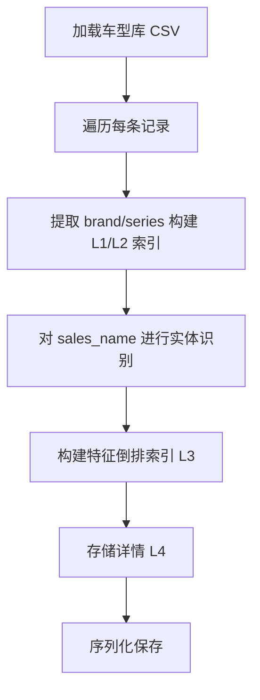
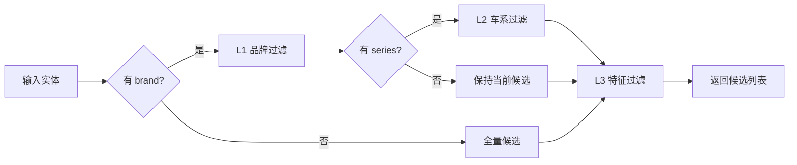

# 车型库索引规格说明 (Vehicle Index Spec)

## 1. 目标

构建高效的车型库索引结构，支持快速查询和过滤，目标单次查询 < 10ms。

---

## 2. 输入/输出

### 构建输入
```python
vehicle_library: pd.DataFrame  # 车型库数据
# 必需字段: brand, series, models, sales_name, year, level_id
```

### 查询输入
```python
@dataclass
class QueryEntities:
    brand: Optional[str]
    series: Optional[str]
    year: Optional[int]
    displacement: Optional[str]
    # ... 其他实体
```

### 查询输出
```python
List[VehicleCandidate]  # 候选车型列表

@dataclass
class VehicleCandidate:
    level_id: str
    brand: str
    series: str
    sales_name: str
    year: int
    entities: dict  # 从 sales_name 提取的实体
```

---

## 3. 索引架构

### 多级索引结构

```
Level 1: 品牌索引 (HashMap)
    └── "宝马" -> [level_ids...]
    └── "大众" -> [level_ids...]
    
Level 2: 车系索引 (HashMap)
    └── ("宝马", "X1") -> [level_ids...]
    └── ("大众", "帕萨特") -> [level_ids...]
    
Level 3: 特征倒排索引 (Inverted Index)
    └── "2.0T" -> [level_ids...]
    └── "自动" -> [level_ids...]
    └── "豪华版" -> [level_ids...]
    
Level 4: 详情存储 (HashMap)
    └── level_id -> VehicleDetail
```

---

## 4. 接口定义

```python
class VehicleIndex:
    """车型库索引"""
    
    def __init__(self, entity_extractor: EntityExtractor):
        """
        初始化索引
        
        Args:
            entity_extractor: 实体识别器实例
        """
        self.entity_extractor = entity_extractor
        self.brand_index: Dict[str, Set[str]] = {}
        self.series_index: Dict[Tuple[str, str], Set[str]] = {}
        self.feature_index: Dict[str, Set[str]] = {}
        self.detail_store: Dict[str, VehicleDetail] = {}
    
    def build(self, vehicle_library: pd.DataFrame) -> None:
        """
        构建索引
        
        Args:
            vehicle_library: 车型库 DataFrame
        """
        pass
    
    def search(
        self, 
        entities: QueryEntities,
        filters: Optional[Dict] = None
    ) -> List[VehicleCandidate]:
        """
        搜索候选车型
        
        Args:
            entities: 查询实体
            filters: 额外过滤条件
            
        Returns:
            候选车型列表
        """
        pass
    
    def filter_by_brand(self, brand: str) -> Set[str]:
        """按品牌过滤"""
        pass
    
    def filter_by_series(self, brand: str, series: str) -> Set[str]:
        """按车系过滤"""
        pass
    
    def get_detail(self, level_id: str) -> Optional[VehicleDetail]:
        """获取车型详情"""
        pass
    
    def save(self, path: str) -> None:
        """持久化索引到文件"""
        pass
    
    def load(self, path: str) -> None:
        """从文件加载索引"""
        pass
```

---

## 5. 构建流程



---

## 6. 查询流程



---

## 7. 性能要求

| 指标 | 目标值 |
|------|--------|
| 索引构建时间 (10万条) | < 30 秒 |
| 单次查询时间 | < 10 毫秒 |
| 内存占用 (10万条) | < 500 MB |
| 索引文件大小 | < 100 MB |

---

## 8. 持久化格式

使用 `pickle` 或 `joblib` 序列化：

```python
# 保存
index_data = {
    "brand_index": self.brand_index,
    "series_index": self.series_index,
    "feature_index": self.feature_index,
    "detail_store": self.detail_store,
    "version": "1.0",
    "build_time": datetime.now().isoformat()
}
joblib.dump(index_data, "index/vehicle_index.pkl")

# 加载
index_data = joblib.load("index/vehicle_index.pkl")
```

---

## 9. 验收标准

- [ ] 10万条记录索引构建 < 30秒
- [ ] 单次查询 < 10ms
- [ ] 品牌过滤后候选数量减少 > 90%
- [ ] 车系过滤后候选数量减少 > 95%
- [ ] 支持索引持久化和加载
